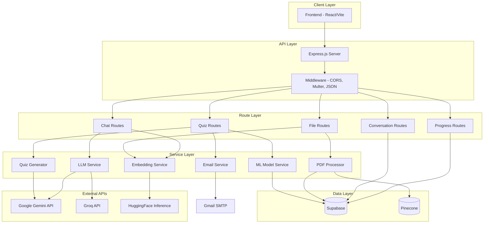

# Design Document: Backend JavaScript Migration

## Overview

This document describes the architecture and design for migrating the Python/Flask backend to JavaScript/Node.js. The new backend will use Express.js as the web framework, with LangChain.js for AI/LLM integrations, Supabase JS client for database operations, and the Pinecone Node.js SDK for vector search.

The migration preserves all existing functionality while modernizing the codebase to use JavaScript best practices, ES modules, and async/await patterns.

## Architecture



## Components and Interfaces

### 1. Express Server (src/app.js)

The main application entry point that configures Express, middleware, and routes.

```javascript
// Configuration
const app = express();
app.use(cors({ origin: process.env.CORS_ALLOW_ORIGIN, credentials: true }));
app.use(express.json());
app.use('/uploads', express.static('uploads'));

// File upload middleware
const upload = multer({
  dest: 'uploads/',
  limits: { fileSize: 5 * 1024 * 1024 } // 5MB
});

// Route registration
app.use('/api', chatRoutes);
app.use('/api', fileRoutes);
app.use('/api', quizRoutes);
app.use('/api', progressRoutes);
app.use('/api', conversationRoutes);
```

### 2. LLM Service (src/services/llmService.js)

Manages AI model interactions using LangChain.js.

```javascript
import { ChatGoogleGenerativeAI } from '@langchain/google-genai';
import { ChatGroq } from '@langchain/groq';
import { RunnableWithMessageHistory } from '@langchain/core/runnables';
import { ChatMessageHistory } from 'langchain/stores/message/in_memory';

class LLMService {
  constructor() {
    this.gemini = new ChatGoogleGenerativeAI({
      model: 'gemini-2.5-flash',
      apiKey: process.env.GEMINI_API_KEY,
      temperature: 0.7
    });
    
    this.groq = new ChatGroq({
      model: 'llama-3.1-8b-instant',
      apiKey: process.env.GROQ_API_KEY,
      temperature: 0.3
    });
    
    this.groqGemma = new ChatGroq({
      model: 'gemma2-9b-it',
      apiKey: process.env.GROQ_API_KEY,
      temperature: 0.3
    });
    
    this.messageHistories = new Map();
  }
  
  getMessageHistory(sessionId) {
    if (!this.messageHistories.has(sessionId)) {
      this.messageHistories.set(sessionId, new ChatMessageHistory());
    }
    return this.messageHistories.get(sessionId);
  }
  
  async chat(message, sessionId) {
    const history = this.getMessageHistory(sessionId);
    const messages = await history.getMessages();
    
    // Keep only last 10 messages (sliding window)
    const recentMessages = messages.slice(-10);
    
    const response = await this.gemini.invoke([
      ...recentMessages,
      { role: 'user', content: message }
    ]);
    
    await history.addUserMessage(message);
    await history.addAIMessage(response.content);
    
    return response.content;
  }
  
  async generateTitle(userMessage, aiResponse) {
    const prompt = `Generate a short title (3-6 words) for this conversation:
    User: ${userMessage}
    Assistant: ${aiResponse}`;
    
    const response = await this.gemini.invoke([{ role: 'user', content: prompt }]);
    return response.content.replace(/"/g, '').trim();
  }
}
```

### 3. Embedding Service (src/services/embeddingService.js)

Generates vector embeddings using HuggingFace models via the Transformers.js library or HuggingFace Inference API.

```javascript
import { HuggingFaceInferenceEmbeddings } from '@langchain/community/embeddings/hf';

class EmbeddingService {
  constructor() {
    this.embeddings = new HuggingFaceInferenceEmbeddings({
      model: 'sentence-transformers/all-mpnet-base-v2',
      apiKey: process.env.HUGGINGFACE_API_KEY
    });
  }
  
  async embedDocuments(texts) {
    return await this.embeddings.embedDocuments(texts);
  }
  
  async embedQuery(text) {
    return await this.embeddings.embedQuery(text);
  }
}
```

### 4. PDF Processor (src/services/pdfProcessor.js)

Handles PDF text extraction, chunking, and storage.

```javascript
import pdfParse from 'pdf-parse';
import { RecursiveCharacterTextSplitter } from 'langchain/text_splitters';
import crypto from 'crypto';

class PDFProcessor {
  constructor(supabase, embeddingService, pineconeIndex) {
    this.supabase = supabase;
    this.embeddingService = embeddingService;
    this.pineconeIndex = pineconeIndex;
    this.splitter = new RecursiveCharacterTextSplitter({
      chunkSize: 500,
      chunkOverlap: 50
    });
  }
  
  async processForChat(filePath, userId, fileHash) {
    const fileBuffer = await fs.readFile(filePath);
    const pdfData = await pdfParse(fileBuffer);
    const text = pdfData.text;
    
    if (!text.trim()) {
      throw new Error('Empty or unreadable PDF');
    }
    
    const chunks = await this.splitter.splitText(text);
    const fileUuid = crypto.randomUUID();
    const fileName = path.basename(filePath);
    
    // Generate embeddings
    const embeddings = await this.embeddingService.embedDocuments(chunks);
    
    // Store in Supabase
    const rows = chunks.map((chunk, i) => ({
      chunk_id: `${fileUuid}_chunk_${i}`,
      content: chunk,
      embedding: embeddings[i],
      filename: fileName,
      file_uuid: fileUuid,
      user_id: userId,
      uploaded_at: new Date().toISOString(),
      hash_file: fileHash
    }));
    
    await this.supabase.from('documents').insert(rows);
    
    // Upsert to Pinecone
    const vectors = embeddings.map((embedding, i) => ({
      id: `${fileUuid}_chunk_${i}`,
      values: embedding,
      metadata: { user_id: userId, file_name: fileName, file_uuid: fileUuid }
    }));
    
    await this.pineconeIndex.upsert(vectors);
    
    // Cleanup
    await fs.unlink(filePath);
    
    return { success: true, chunkCount: chunks.length, fileName, fileUuid };
  }
}
```

### 5. Quiz Generator (src/services/quizGenerator.js)

Generates MCQ questions from topic content.

```javascript
class QuizGenerator {
  constructor(llmService, supabase) {
    this.llmService = llmService;
    this.supabase = supabase;
  }
  
  async generateMCQs(topicId, difficulty, userId) {
    // Fetch topic content
    const { data: topic } = await this.supabase
      .from('topics')
      .select('merged_content')
      .eq('topic_id', topicId)
      .single();
    
    // Get previous wrong answers if user has attempted before
    let mistakeQuestions = [];
    if (userId) {
      mistakeQuestions = await this.getPreviousMistakes(userId, topicId);
    }
    
    const numToGenerate = 10 - mistakeQuestions.length;
    
    const prompt = this.buildPrompt(topic.merged_content, difficulty, numToGenerate);
    const response = await this.llmService.gemini.invoke([
      { role: 'user', content: prompt }
    ]);
    
    const questions = this.parseResponse(response.content);
    
    // Combine with mistake questions
    const allQuestions = [...mistakeQuestions, ...questions];
    
    // Save to database
    return await this.saveQuestions(allQuestions, topicId);
  }
  
  parseResponse(text) {
    // Parse MCQ format from LLM response
    const questions = [];
    const questionBlocks = text.split(/Question \d+:/i).slice(1);
    
    for (const block of questionBlocks) {
      const questionMatch = block.match(/^(.*?)(?:\nA\))/s);
      const optionsMatch = block.match(/[A-D]\)\s*(.*)/g);
      const answerMatch = block.match(/Answer:\s*\[?([A-D])\]?\s*-\s*(.*)/);
      const explanationMatch = block.match(/Explanation:\s*(.*)/);
      
      if (questionMatch && optionsMatch && answerMatch) {
        questions.push({
          question_text: questionMatch[1].trim(),
          options: optionsMatch.map(o => o.replace(/^[A-D]\)\s*/, '')),
          correct_answer: answerMatch[1],
          explanation: explanationMatch?.[1] || 'No explanation provided.'
        });
      }
    }
    
    return questions;
  }
}
```

### 6. ML Model Service (src/services/mlModelService.js)

Handles XGBoost model predictions for review scheduling.

```javascript
import XGBoostScorer from 'xgboost-scorer';

class MLModelService {
  constructor() {
    this.model = null;
  }
  
  async loadModel(modelPath) {
    // Load the XGBoost model JSON dump
    const modelJson = await fs.readFile(modelPath, 'utf-8');
    this.model = new XGBoostScorer(JSON.parse(modelJson));
  }
  
  predictNextReviewDays(latestScore, avgScore, attemptsCount, daysSinceLastAttempt) {
    const features = [latestScore, avgScore, attemptsCount, daysSinceLastAttempt];
    const prediction = this.model.predict([features]);
    return Math.round(prediction[0]);
  }
}
```

### 7. Email Service (src/services/emailService.js)

Handles email sending via Nodemailer.

```javascript
import nodemailer from 'nodemailer';

class EmailService {
  constructor() {
    this.transporter = nodemailer.createTransport({
      service: 'gmail',
      auth: {
        user: process.env.GMAIL_USER,
        pass: process.env.GMAIL_APP_PASSWORD
      }
    });
  }
  
  async sendEmail(to, subject, html) {
    try {
      await this.transporter.sendMail({
        from: process.env.GMAIL_USER,
        to,
        subject,
        html
      });
      console.log('✅ Email sent successfully');
      return true;
    } catch (error) {
      console.error('❌ Failed to send email:', error);
      return false;
    }
  }
  
  sendEmailAsync(to, subject, html) {
    // Fire and forget
    setImmediate(() => this.sendEmail(to, subject, html));
  }
}
```

## Data Models

### Database Schema (Supabase)

The existing Supabase schema remains unchanged. Key tables:

```sql
-- Documents table for PDF chunks
documents (
  id SERIAL PRIMARY KEY,
  chunk_id TEXT UNIQUE,
  content TEXT,
  embedding VECTOR(768),
  metadata JSONB,
  filename TEXT,
  file_uuid UUID,
  user_id UUID,
  uploaded_at TIMESTAMP,
  hash_file TEXT
)

-- Topics for quiz generation
topics (
  topic_id UUID PRIMARY KEY,
  user_id UUID,
  document_for_quiz_id UUID,
  title TEXT,
  merged_content TEXT,
  topic_summary TEXT,
  topic_status TEXT,
  file_name TEXT,
  hash_file TEXT
)

-- Quiz questions
quiz_questions (
  question_id UUID PRIMARY KEY,
  concept_id UUID REFERENCES topics(topic_id),
  prompt TEXT,
  answer CHAR(1),
  answer_option_text JSONB,
  explanation TEXT,
  created_at TIMESTAMP
)

-- Quiz attempts
quiz_attempts (
  attempt_id UUID PRIMARY KEY,
  user_id UUID,
  topic_id UUID,
  score DECIMAL,
  submitted_at TIMESTAMP
)

-- Quiz answers
quiz_answers (
  answer_id UUID PRIMARY KEY,
  attempt_id UUID REFERENCES quiz_attempts(attempt_id),
  question_id UUID,
  selected_answer CHAR(1),
  selected_answer_text TEXT,
  is_correct BOOLEAN
)

-- Conversations
conversations (
  conversation_id UUID PRIMARY KEY,
  user_id UUID,
  title TEXT,
  created_at TIMESTAMP,
  updated_at TIMESTAMP
)

-- Chat logs
chat_logs (
  id SERIAL PRIMARY KEY,
  user_id UUID,
  conversation_id UUID,
  user_message TEXT,
  response_message TEXT,
  created_at TIMESTAMP,
  message_id UUID
)

-- User topic progress
user_topic_progress (
  user_id UUID,
  topic_id UUID,
  last_score DECIMAL,
  attempts_count INTEGER,
  mastered BOOLEAN,
  last_attempt TIMESTAMP,
  PRIMARY KEY (user_id, topic_id)
)

-- User topic review features (for ML model)
user_topic_review_features (
  user_id UUID,
  topic_id UUID,
  latest_score DECIMAL,
  avg_score DECIMAL,
  attempts_count INTEGER,
  last_attempt_date DATE,
  next_review_date DATE,
  mastered BOOLEAN,
  PRIMARY KEY (user_id, topic_id)
)

-- Flashcards
flashcards (
  id SERIAL PRIMARY KEY,
  user_id UUID,
  attempt_id UUID,
  topic_id UUID,
  core_concept TEXT,
  key_theory TEXT,
  common_mistake TEXT,
  created_at TIMESTAMP
)
```

### API Request/Response Models

```typescript
// Chat Request
interface ChatRequest {
  message: string;
  user_id?: string;
  conversation_id?: string;
}

// Chat Response
interface ChatResponse {
  response: string;
  conversation_id: string;
}

// Quiz Generation Request
interface QuizGenerationRequest {
  user_id: string;
  topic_id: string;
  difficulty_mode?: 'easy' | 'medium' | 'hard';
}

// Quiz Question Response
interface QuizQuestion {
  question_id: string;
  question_text: string;
  options: string[];
  correct_answer?: string;
  answer_text?: string;
  explanation?: string;
}

// Quiz Submission Request
interface QuizSubmissionRequest {
  user_id: string;
  topic_id: string;
  email?: string;
  submitted_answers: Array<{
    question_id: string;
    selected_answer: string;
  }>;
}

// Quiz Result Response
interface QuizResult {
  score: number;
  total_questions: number;
  correct_answers: number;
}
```

## Correctness Properties

*A property is a characteristic or behavior that should hold true across all valid executions of a system—essentially, a formal statement about what the system should do. Properties serve as the bridge between human-readable specifications and machine-verifiable correctness guarantees.*


### Property 1: File Size Validation
*For any* file upload request where the file size exceeds 5MB, the server SHALL return a 413 status code and reject the upload.
**Validates: Requirements 1.4**

### Property 2: Conversation History Sliding Window
*For any* conversation with more than 10 messages, only the most recent 10 messages SHALL be retained in memory and used for context.
**Validates: Requirements 3.3**

### Property 3: Embedding Dimensionality
*For any* text input to the embedding service, the generated embedding SHALL have exactly 768 dimensions.
**Validates: Requirements 3.5**

### Property 4: Chat Response Generation
*For any* valid chat message, the server SHALL return a non-empty AI-generated response.
**Validates: Requirements 4.1**

### Property 5: Conversation Persistence
*For any* new conversation, a record SHALL be created in the database, and for the first message, a non-default title SHALL be generated.
**Validates: Requirements 4.2, 4.3, 4.4**

### Property 6: Message Routing by Keywords
*For any* message containing summary keywords (e.g., "summarize", "overview"), the system SHALL route to the summary handler. For question keywords, it SHALL route to question generation. Otherwise, it SHALL route to document Q&A.
**Validates: Requirements 4.5**

### Property 7: PDF Text Chunking
*For any* extracted PDF text, the chunking algorithm SHALL produce chunks of approximately 500 characters with 50 character overlap between consecutive chunks.
**Validates: Requirements 5.1, 5.2**

### Property 8: PDF Processing Pipeline Round-Trip
*For any* successfully processed PDF, the chunks SHALL be stored in Supabase with embeddings, vectors SHALL be upserted to Pinecone, and the original file SHALL be deleted from disk.
**Validates: Requirements 5.3, 5.4, 5.7**

### Property 9: Duplicate File Detection
*For any* file with a hash that already exists for the same user, the server SHALL return a 409 conflict status.
**Validates: Requirements 5.5**

### Property 10: File Type Validation
*For any* file with an extension not in the allowed list (pdf, doc, docx, txt), the server SHALL return a 400 error.
**Validates: Requirements 5.6**

### Property 11: Topic Generation Uniqueness
*For any* set of generated topics from a PDF, no two topic titles SHALL have greater than 80% string similarity, and each title SHALL be at most 5 words.
**Validates: Requirements 6.3, 6.4**

### Property 12: Quiz Question Generation
*For any* quiz generation request, exactly 10 questions SHALL be returned, with correct answers distributed across A, B, C, D options (not all the same).
**Validates: Requirements 7.1, 7.5**

### Property 13: Quiz Scoring Calculation
*For any* quiz submission, the score SHALL equal (correct_count / total_questions) * 10.
**Validates: Requirements 8.1, 8.2**

### Property 14: Quiz Submission State Updates
*For any* quiz submission, records SHALL be created in quiz_attempts and quiz_answers tables, user_topic_progress SHALL be updated, and topic_status SHALL be set to "Completed" if score > 7, otherwise "Weak".
**Validates: Requirements 8.3, 8.4, 8.5**

### Property 15: Progress Retrieval Ordering
*For any* user progress request, attempts SHALL be returned in descending order by submitted_at timestamp.
**Validates: Requirements 9.1, 9.2**

### Property 16: Conversation CRUD Consistency
*For any* conversation, creating it SHALL make it retrievable, updating it SHALL change the title, and deleting it SHALL remove both the conversation and all associated chat logs.
**Validates: Requirements 10.1, 10.2, 10.3, 10.4, 10.5**

### Property 17: Flashcard Generation
*For any* flashcard generation request, exactly 10 flashcards SHALL be generated with core_concept and key_theory fields, prioritizing incorrect answers. Duplicate requests SHALL return existing flashcards.
**Validates: Requirements 11.1, 11.2, 11.3, 11.4, 11.5**

### Property 18: Weak Topic Updates
*For any* topic with next_review_date before today, the topic_status SHALL be updated to "Weak" and the latest attempt score SHALL be reset to 0.
**Validates: Requirements 12.1, 12.2, 12.3**

### Property 19: Email Error Resilience
*For any* email sending failure, the error SHALL be logged and the application SHALL continue running without crashing.
**Validates: Requirements 13.3**

### Property 20: ML Model Prediction
*For any* valid feature input (latest_score, avg_score, attempts_count, days_since_last_attempt), the ML model SHALL return a positive integer representing days until next review.
**Validates: Requirements 14.2, 14.3**

### Property 21: Document Q&A Pipeline
*For any* document question, the system SHALL query Pinecone filtered by user_id, fetch chunk content from Supabase, and generate an answer using the LLM.
**Validates: Requirements 15.3, 15.4, 15.5**

## Error Handling

### HTTP Error Responses

| Status Code | Condition | Response Body |
|-------------|-----------|---------------|
| 400 | Invalid request (missing fields, invalid file type) | `{ "error": "Description of error" }` |
| 404 | Resource not found | `{ "error": "Resource not found" }` |
| 409 | Duplicate resource (file already uploaded) | `{ "message": "You have already uploaded this file earlier." }` |
| 413 | File too large | `{ "error": "File is too large. Max size is 5MB" }` |
| 500 | Internal server error | `{ "error": "Something went wrong" }` |

### Error Handling Strategy

1. **Database Errors**: Catch Supabase errors, log them, and return 500 with generic message
2. **AI/LLM Errors**: Implement retry logic with exponential backoff, fallback to error response
3. **File Processing Errors**: Clean up temporary files, return descriptive error
4. **Validation Errors**: Return 400 with specific field validation messages

```javascript
// Global error handler middleware
app.use((err, req, res, next) => {
  console.error('Error:', err);
  
  if (err.code === 'LIMIT_FILE_SIZE') {
    return res.status(413).json({ error: 'File is too large. Max size is 5MB' });
  }
  
  if (err.name === 'ValidationError') {
    return res.status(400).json({ error: err.message });
  }
  
  res.status(500).json({ error: 'Something went wrong' });
});
```

## Testing Strategy

### Unit Tests

Unit tests will verify individual functions and modules in isolation:

- **LLM Service**: Test message history management, title generation parsing
- **PDF Processor**: Test text chunking algorithm, hash calculation
- **Quiz Generator**: Test MCQ response parsing, answer distribution
- **ML Model Service**: Test prediction output format
- **Email Service**: Test email template generation

### Property-Based Tests

Property-based tests will use fast-check to verify universal properties:

- **P7 (Chunking)**: Generate random text, verify chunk sizes and overlaps
- **P9 (Duplicate Detection)**: Generate random file hashes, verify detection
- **P12 (Quiz Generation)**: Verify answer distribution across options
- **P13 (Scoring)**: Generate random answer sets, verify score calculation
- **P15 (Ordering)**: Generate random timestamps, verify sort order

### Integration Tests

Integration tests will verify end-to-end flows:

- **Chat Flow**: Send message → receive response → verify storage
- **Upload Flow**: Upload PDF → verify chunks in DB → verify vectors in Pinecone
- **Quiz Flow**: Generate questions → submit answers → verify scoring and progress

### Test Configuration

```javascript
// jest.config.js
module.exports = {
  testEnvironment: 'node',
  testMatch: ['**/*.test.js'],
  collectCoverageFrom: ['src/**/*.js'],
  coverageThreshold: {
    global: {
      branches: 80,
      functions: 80,
      lines: 80
    }
  }
};

// Property test configuration (fast-check)
const fcConfig = {
  numRuns: 100,
  verbose: true
};
```

## Project Structure

```
backend-js/
├── src/
│   ├── app.js                    # Express app setup
│   ├── config/
│   │   └── index.js              # Environment configuration
│   ├── routes/
│   │   ├── chatRoutes.js         # Chat endpoints
│   │   ├── fileRoutes.js         # File upload endpoints
│   │   ├── quizRoutes.js         # Quiz endpoints
│   │   ├── progressRoutes.js     # Progress endpoints
│   │   └── conversationRoutes.js # Conversation endpoints
│   ├── services/
│   │   ├── llmService.js         # LLM interactions
│   │   ├── embeddingService.js   # Embedding generation
│   │   ├── pdfProcessor.js       # PDF processing
│   │   ├── quizGenerator.js      # Quiz generation
│   │   ├── mlModelService.js     # ML predictions
│   │   └── emailService.js       # Email sending
│   ├── utils/
│   │   ├── supabase.js           # Supabase client
│   │   ├── pinecone.js           # Pinecone client
│   │   └── helpers.js            # Utility functions
│   └── middleware/
│       ├── errorHandler.js       # Global error handling
│       └── upload.js             # Multer configuration
├── tests/
│   ├── unit/
│   │   ├── llmService.test.js
│   │   ├── pdfProcessor.test.js
│   │   └── quizGenerator.test.js
│   ├── property/
│   │   ├── chunking.property.test.js
│   │   ├── scoring.property.test.js
│   │   └── ordering.property.test.js
│   └── integration/
│       ├── chat.integration.test.js
│       ├── upload.integration.test.js
│       └── quiz.integration.test.js
├── uploads/                      # Temporary file storage
├── model.json                    # XGBoost model (converted from .pkl)
├── package.json
├── .env
└── README.md
```

## Dependencies

```json
{
  "dependencies": {
    "express": "^4.18.2",
    "cors": "^2.8.5",
    "dotenv": "^16.3.1",
    "multer": "^1.4.5-lts.1",
    "@supabase/supabase-js": "^2.39.0",
    "@pinecone-database/pinecone": "^2.0.0",
    "@langchain/core": "^0.2.0",
    "@langchain/google-genai": "^0.0.26",
    "@langchain/groq": "^0.0.12",
    "@langchain/community": "^0.2.0",
    "langchain": "^0.2.0",
    "pdf-parse": "^1.1.1",
    "nodemailer": "^6.9.7",
    "xgboost-scorer": "^1.0.0",
    "uuid": "^9.0.0",
    "crypto": "^1.0.1"
  },
  "devDependencies": {
    "jest": "^29.7.0",
    "fast-check": "^3.14.0",
    "supertest": "^6.3.3"
  }
}
```
